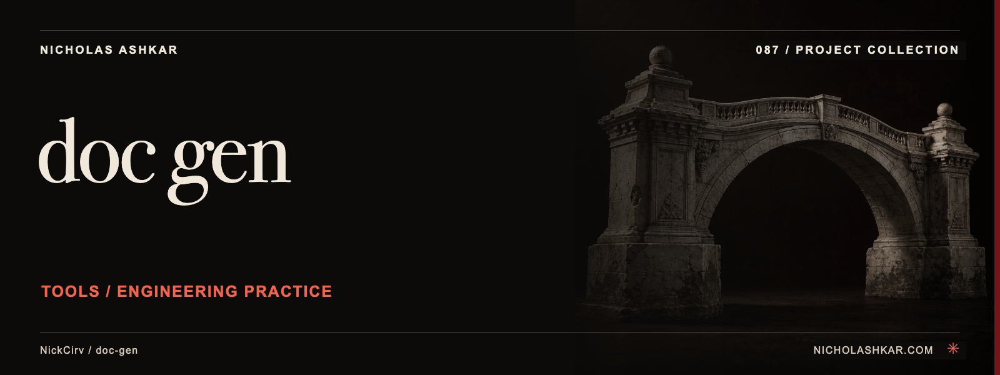

# doc-gen

Draft a README from a local project's manifest, scripts and framework hints.

> **Local repair candidate.** This checkout adds the missing command dispatcher to source revision `c419dbebba05cd3aa15420bcaf1117a01c028b20`. The repair has not been published upstream. See [repair evidence](REPAIR-REPORT.md).

## Quickstart

Use Node.js 20 or later. From this candidate checkout:

```bash
npm install --ignore-scripts --no-audit --no-fund
node bin/gen.js --help
node bin/gen.js readme --dir /absolute/path/to/project --preview
```

Help and preview were exercised against temporary fixtures. Preview prints the complete draft without changing README.md. Review the draft before choosing to write it:

```bash
node bin/gen.js readme --dir /absolute/path/to/project
```

**The write command replaces an existing regular README.md.** Symlinks, multiply linked files and non-file targets are refused before truncation. Keep a copy or review it under version control before running it on an authored document.

## Usage

| Command or option | Purpose | Default |
| --- | --- | --- |
| `readme` | Detect a project and assemble its README draft | Required for generation |
| `--dir PATH` | Existing project directory | Current directory |
| `--preview` | Print the full draft without writing | Off |
| `--help` | Display supported command help | No generation |

No arguments display help. Unknown commands, unknown options, missing values and invalid directories return a nonzero exit status. API-reference, directory-tree and changelog generation are not implemented by the captured modules; the dispatcher rejects those commands.

## What the generator reads

The detector inspects manifest names, dependencies, script entries, common config files and known entrypoint paths. It recognizes several language/framework conventions and uses these hints to produce installation, usage, script, testing, contribution and license sections. It does not execute the target project or verify those instructions.

## Limits

Generated text is a draft. The inherited template hardcodes version `1.0.0` and MIT labels, proposes package-install commands without proving publication, and includes placeholder repository URLs. Confirm the real license, version, repository URL and installation method before using its output. Malformed manifests can fall back to incomplete metadata rather than providing a full validation report.

This repair restores startup and the existing README workflow; it does not implement semantic documentation extraction or guarantee adherence of generated output to the portfolio editorial standard.

## Development and verification

```bash
npm test
```

Seven tests passed on Node.js 26.7.0: entrypoint syntax plus behavior covering help, full preview, fixture output, invalid invocations and refusal of symlink/hardlink/directory targets. No Node 20 compatibility run or target-application execution was performed. The declared Node requirement is the existing manifest requirement, not a tested version matrix.

## License and author

[MIT license](LICENSE). [Nicholas Ashkar](https://nicholashkar.com#oxblood-contact) — applied AI, systems and consulting.

<a id="install"></a>
<a id="what-it-does"></a>
<a id="usage-and-reference"></a>
<a id="limits-and-operational-notes"></a>
<a id="research-and-status"></a>
